# Диаграммы архитектуры NormaML

## Общая архитектура системы

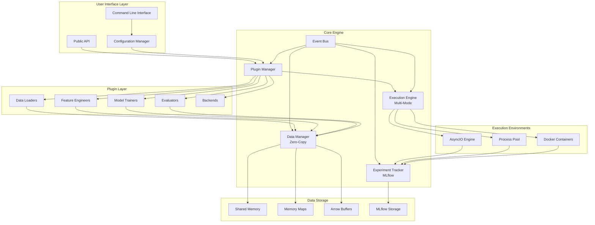

## Plugin System Architecture

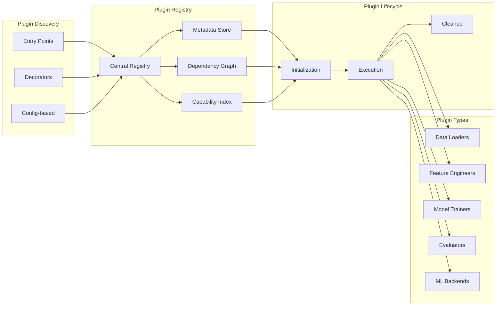

## Zero-Copy Data Flow

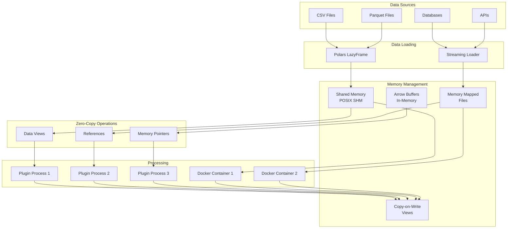

## Parallel Execution Architecture

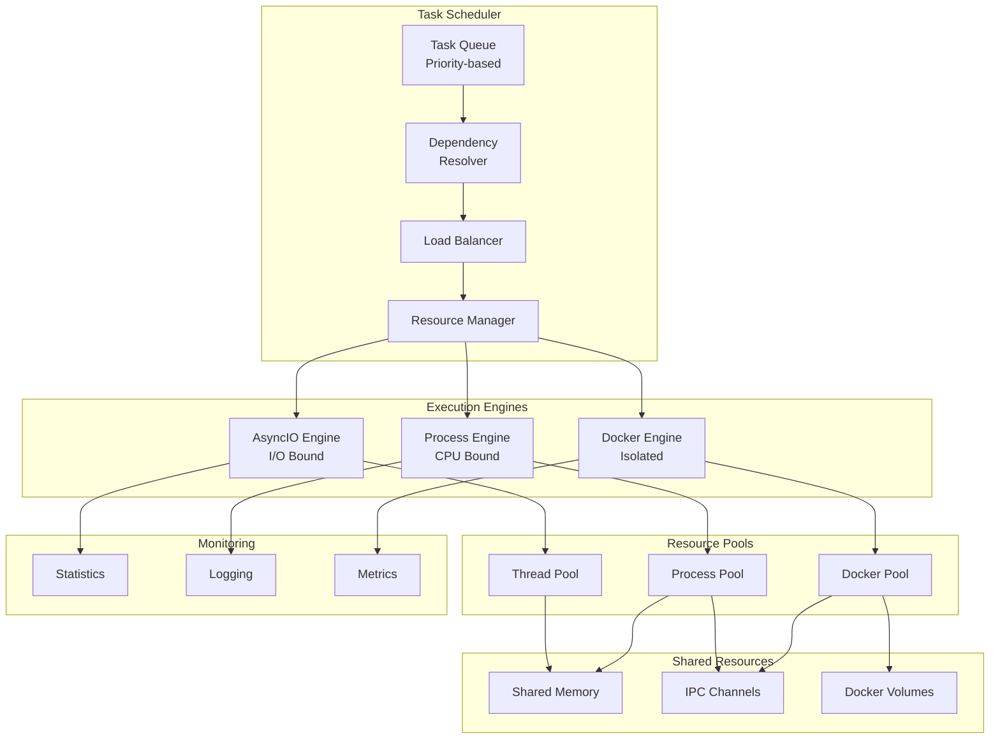

## MLflow Integration Flow

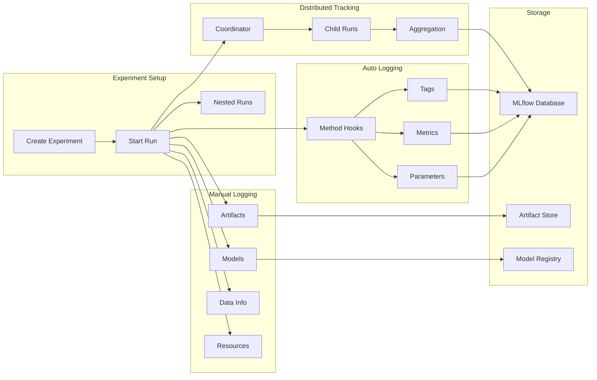

## Component Interaction Flow

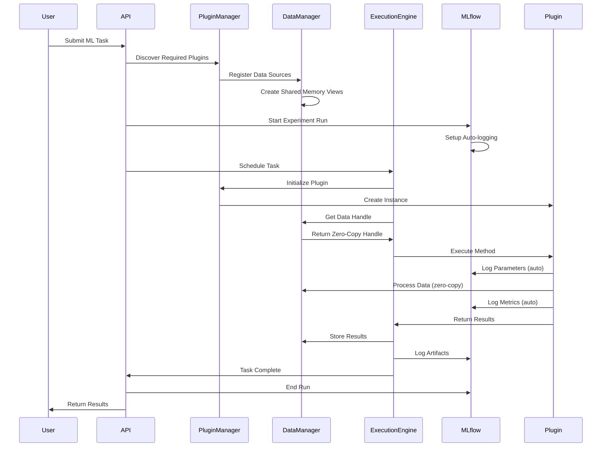

## Data Pipeline Flow

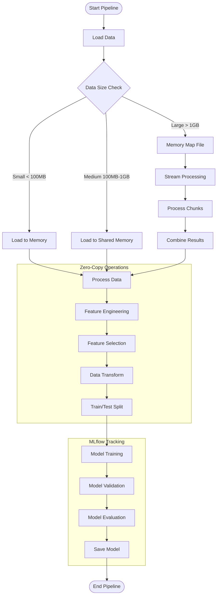

## Security and Isolation Model

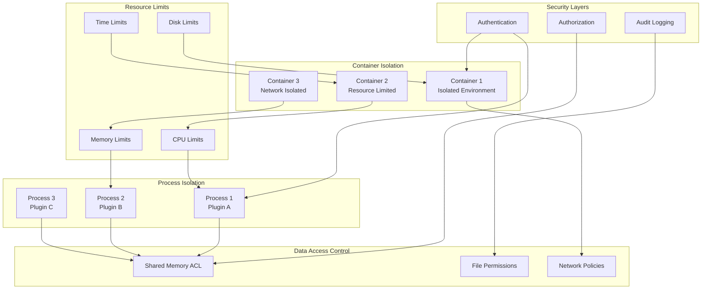

## Performance Optimization Flow

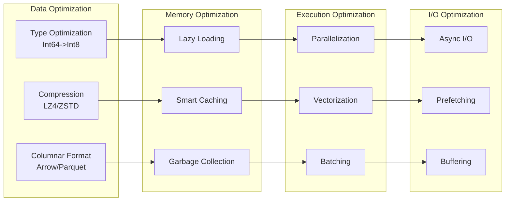

## Error Handling and Recovery

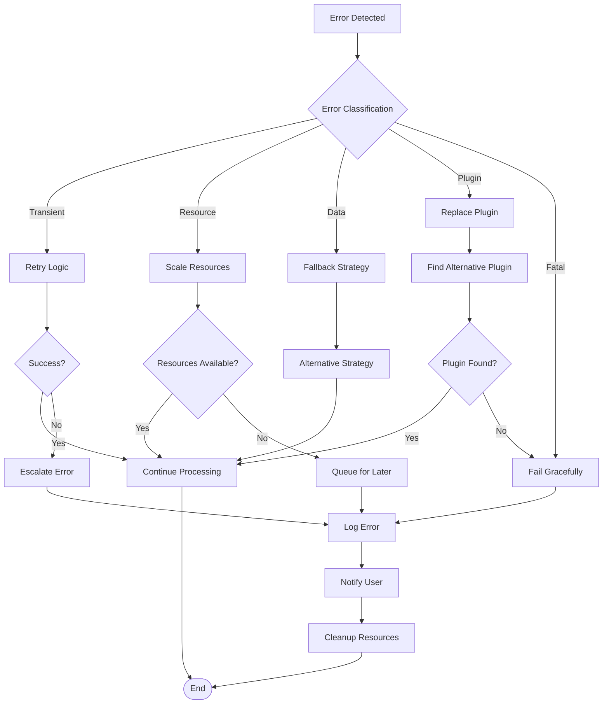

## Deployment Architecture

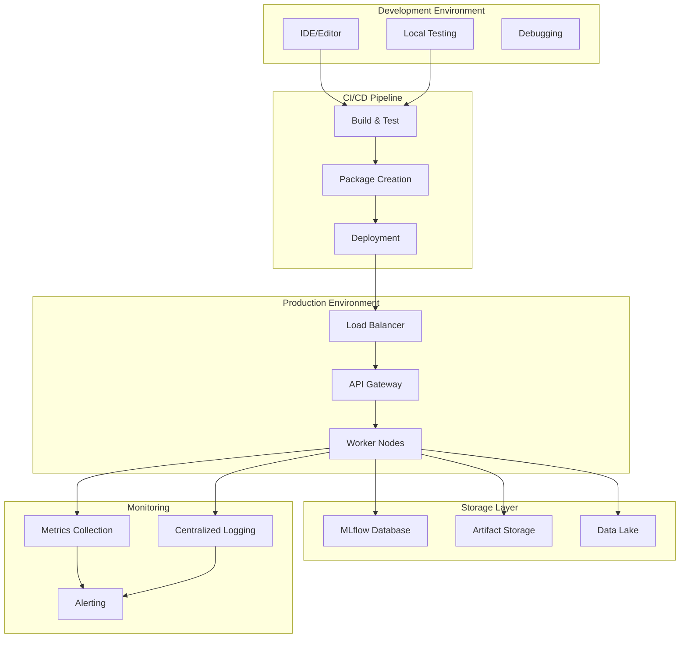

## Configuration Management

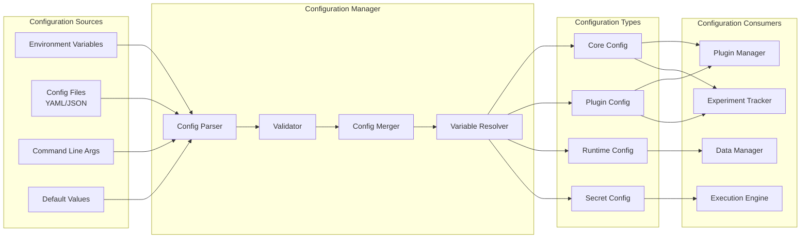

Эти диаграммы показывают:

1. **Общую архитектуру** - взаимодействие основных компонентов
2. **Plugin систему** - обнаружение, регистрация и выполнение
3. **Zero-copy data flow** - эффективная передача данных
4. **Параллельное выполнение** - управление ресурсами и задачами
5. **MLflow интеграцию** - отслеживание экспериментов
6. **Взаимодействие компонентов** - последовательность операций
7. **Data pipeline** - обработка данных от начала до конца
8. **Безопасность** - изоляция и контроль доступа
9. **Оптимизацию производительности** - стратегии ускорения
10. **Обработку ошибок** - стратегии восстановления
11. **Развертывание** - производственная среда
12. **Управление конфигурацией** - источники и потребители настроек

Архитектура обеспечивает модульность, масштабируемость и производительность при сохранении простоты использования и надежности.